# AWS / Terraform / Kubernetes 完全学習ノート

> AWS・Terraform・Kubernetesを「単語」ではなく、「誰が何を担当し、どのように繋がってシステムが動くか」で理解するためのノート。
>
> 実際に `aws-kubernetes-lab` を構築し、EKS上にFrontend / Backend / PostgreSQLをデプロイし、GitHub ActionsによるCI/CD、OIDC認証、EBS、ALBまで動かした経験をベースに整理している。

---

# 0. 最初に全体像

システム全体を大きく分けると、役割はこうなる。

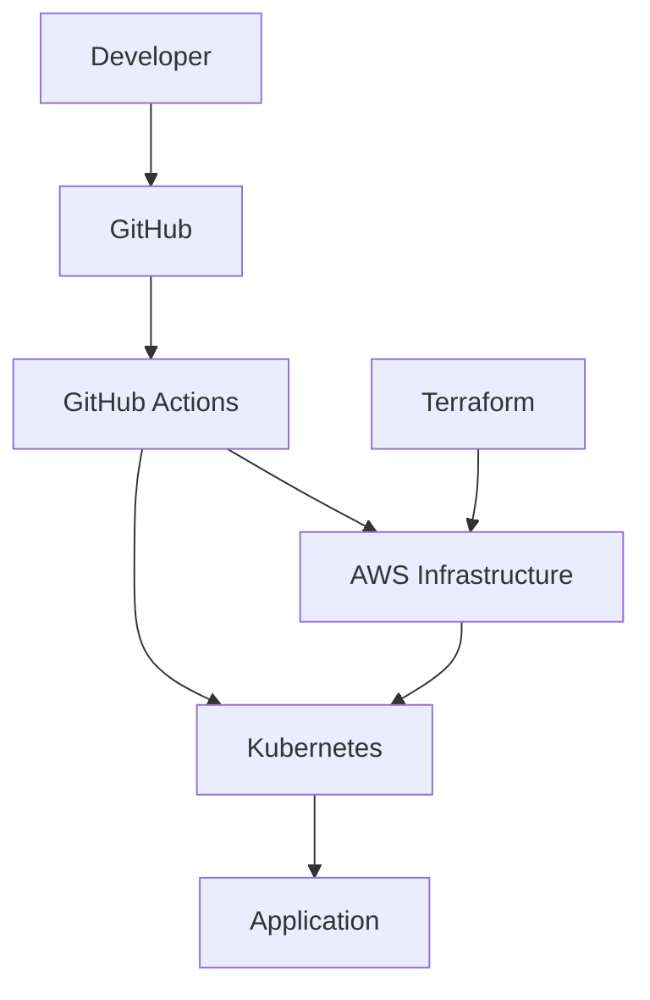

それぞれの責務はかなり違う。

| 技術             | 主な責務                              |
| -------------- | --------------------------------- |
| AWS            | サーバ、ネットワーク、ストレージなどのインフラを提供        |
| Terraform      | AWSインフラのDesired Stateを管理          |
| Kubernetes     | アプリケーションのDesired Stateを管理         |
| Docker         | アプリケーション実行環境をImageとしてまとめる         |
| ECR            | Docker Imageを保存                   |
| EKS            | AWS上でKubernetesを提供                |
| GitHub Actions | Build / Test / Deployなどを自動化       |
| IAM            | AWSで「誰が何をしていいか」を管理                |
| OIDC           | GitHub Actionsなどが長期秘密鍵なしでAWSへ認証する |

重要なのは、

```text
Terraform = AWSを管理

Kubernetes = Kubernetes内のアプリを管理
```

という責務分離。

たとえば、

```text
Terraform
├─ VPC
├─ Subnet
├─ EKS
├─ ECR
├─ IAM Role
└─ OIDC

Kubernetes
├─ Deployment
├─ Service
├─ Ingress
├─ StatefulSet
├─ ConfigMap
├─ Secret
├─ HPA
└─ NetworkPolicy
```

となる。

---

# 1. 実際に作ったシステム

今回最終的に作った構成。

```mermaid
flowchart LR
    Browser[Browser]

    ALB[AWS ALB]
    Ingress[Kubernetes Ingress]

    FrontService[Frontend Service]
    FrontPods[Frontend Pods]

    BackService[Backend Service]
    BackPods[Go Backend Pods]

    Postgres[PostgreSQL StatefulSet]
    PVC[PersistentVolumeClaim]
    PV[PersistentVolume]
    EBS[AWS EBS]

    Browser --> ALB
    ALB --> Ingress

    Ingress --> FrontService
    FrontService --> FrontPods

    FrontPods --> BackService
    BackService --> BackPods

    BackPods --> Postgres

    Postgres --> PVC
    PVC --> PV
    PV --> EBS
```

CI/CD側。

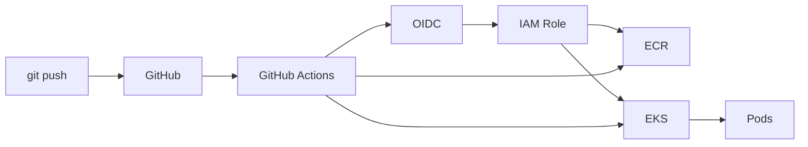

Terraform側。

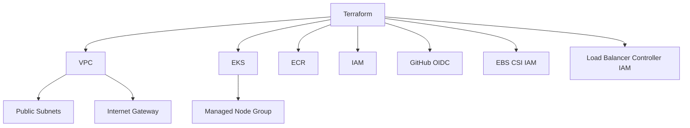

---

# 2. AWSとは何か

AWSはクラウド上で、

```text
Compute
Network
Storage
Database
Security
DNS
Monitoring
```

などを提供するサービス群。

自分で物理サーバを買わなくても、

```text
AWSにAPIで依頼
↓
VM作成
↓
Disk作成
↓
Network作成
↓
Load Balancer作成
```

ということができる。

TerraformはこのAPI操作をコード化している。

---

# 3. AWS Compute

## EC2 — Amazon Elastic Compute Cloud

AWS上の仮想マシン。

```text
物理サーバ
    ↓
仮想化
    ↓
EC2 Instance
```

Linuxなどを起動して自由に使える。

向いているケース。

```text
OSまで自由に触りたい
長時間動くServer
特殊なSoftwareが必要
Container以外も動かしたい
```

今回のEKSでは、Worker Nodeの実体としてEC2が使われた。

```text
EKS
└─ Managed Node Group
    ├─ EC2
    └─ EC2
```

実際には `t3.small` を2台使った。

---

# 4. Lambda

## AWS Lambda

Function単位でコードを実行するServerlessサービス。

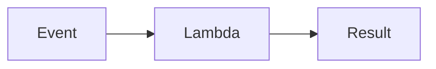

サーバを常時起動しておく必要がない。

向いているもの。

```text
APIの小処理
S3 upload時の処理
Event driven処理
短時間のBatch
Webhook
```

EC2との大きな違い。

```text
EC2
→ Serverを管理する

Lambda
→ Functionを書く
→ Server管理はAWS
```

---

# 5. ECS / EKS / Fargate

## ECS — Amazon Elastic Container Service

AWS独自のContainer Orchestration。

```text
Docker Container
↓
ECS
↓
EC2 or Fargate
```

Kubernetesが必要ない場合に比較的シンプル。

---

## EKS — Amazon Elastic Kubernetes Service

AWSが提供するManaged Kubernetes。

```text
Kubernetes Control Plane
→ AWSが管理

Worker Node
→ EC2 / Fargateなど
```

今回使ったもの。

---

## Fargate

Container用Serverless Compute。

```text
Container
↓
Fargate
↓
AWSがServer管理
```

EC2 Instance自体を直接管理しなくてよい。

---

# 6. AWS Batch

大量のBatch Jobを管理するサービス。

```text
Job
↓
Queue
↓
Scheduler
↓
Compute Environment
```

長時間の計算や大量Jobなど向け。

Lambdaは実行時間や実行モデルに制約があるため、

```text
短時間Event処理
→ Lambda

長時間・大量Batch
→ AWS Batch
```

と考えると分かりやすい。

---

# 7. Computeの選び方

```text
何を動かす？
│
├─ 普通のServer
│   └─ EC2
│
├─ Container
│   │
│   ├─ Kubernetes不要
│   │   └─ ECS
│   │
│   └─ Kubernetes必要
│       └─ EKS
│
├─ Server管理したくない
│   │
│   ├─ Function
│   │   └─ Lambda
│   │
│   └─ Container
│       └─ Fargate
│
└─ 大量Batch
    └─ AWS Batch
```

---

# 8. AWS Networking

AWSネットワークの中心はVPC。

---

# 9. VPC — Virtual Private Cloud

AWS上に作る自分専用の仮想ネットワーク。

今回。

```text
VPC
10.0.0.0/16
```

その中にSubnetを作った。

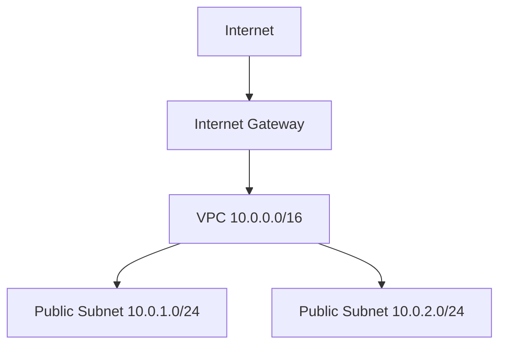

---

# 10. CIDR

例。

```text
10.0.0.0/16
```

`/16` はNetwork部のbit数。

Subnetを、

```text
10.0.1.0/24
10.0.2.0/24
```

のように分割できる。

---

# 11. Subnet

VPCのネットワークをさらに分割したもの。

```text
VPC
├─ Subnet A
├─ Subnet B
└─ Subnet C
```

Availability Zoneごとに配置することが多い。

今回。

```text
ap-northeast-1a
└─ 10.0.1.0/24

ap-northeast-1c
└─ 10.0.2.0/24
```

---

# 12. Public Subnet / Private Subnet

Public Subnet。

```text
Route Table
0.0.0.0/0
    ↓
Internet Gateway
```

を持つ。

Private SubnetはInternet Gatewayへ直接Routeを持たない。

本番ではよく、

```text
Internet
↓
ALB
↓
Public Subnet
↓
Application
↓
Private Subnet
↓
Database
```

のようにする。

今回の学習環境ではコストと構築の単純化のためPublic Subnet中心。

---

# 13. Internet Gateway

VPCとInternetを繋ぐもの。

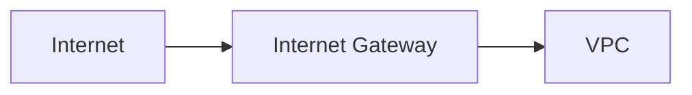

VPCにInternet Gatewayがあるだけでは通信できない。

Route Tableも必要。

---

# 14. Route Table

パケットをどこへ送るか決める。

例。

```text
Destination     Target

10.0.0.0/16     local
0.0.0.0/0       Internet Gateway
```

つまり、

```text
VPC内部
→ local

その他
→ Internet Gateway
```

---

# 15. Security Group

EC2などについているStateful Firewall。

```text
Inbound
Outbound
```

を制御する。

例。

```text
TCP 443
Source ALB Security Group
```

Statefulなので、許可された通信への返答は自動的に許可される。

---

# 16. Network ACL

SubnetレベルのFirewall。

Security Groupとの違い。

|          | Security Group | Network ACL |
| -------- | -------------- | ----------- |
| 単位       | Instance / ENI | Subnet      |
| Stateful | Yes            | No          |
| Allow    | Yes            | Yes         |
| Deny     | No             | Yes         |

---

# 17. Load Balancer

Trafficを複数Serverへ分散する。

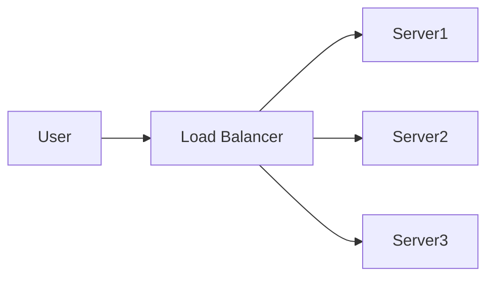

---

# 18. ALB — Application Load Balancer

OSI Layer 7。

HTTP / HTTPSを理解する。

```text
Host
Path
Header
```

などを見てRoutingできる。

例。

```text
/api
→ Backend

/
→ Frontend
```

Kubernetes Ingressと非常に相性がよい。

---

# 19. NLB — Network Load Balancer

Layer 4。

TCP / UDPなど。

HTTPのpathなどは基本見ない。

大量Connectionや低Latency用途。

---

# 20. ALB vs NLB

```text
HTTP Routingしたい
→ ALB

TCPレベルで高速に捌きたい
→ NLB
```

---

# 21. Route 53

AWSのDNSサービス。

```text
example.com
↓
Route 53
↓
ALB
```

今回のLabでは独自Domain / Route 53は使わず、ALBのDNSへ直接アクセスした。

---

# 22. Auto Scaling

負荷に応じてInstance数を変更する。

```text
Load増加
↓
EC2増加

Load減少
↓
EC2減少
```

KubernetesではHPAがPod数を増減する。

AWSのAuto ScalingとKubernetes HPAはレイヤーが違う。

```text
HPA
→ Pod数

EC2 Auto Scaling / Node Autoscaling
→ Node数
```

---

# 23. Storage

AWSでよく使うStorage。

```text
Object
→ S3

Block
→ EBS

Shared File
→ EFS

高性能File System
→ FSx
```

---

# 24. S3 — Amazon Simple Storage Service

Object Storage。

```text
Bucket
└─ Object
```

ファイルサーバというより、

```text
Key → Object
```

というObject Store。

用途。

```text
画像
動画
Backup
Log
Terraform State
Static Website
```

今回Terraform StateのRemote Backendにも使った。

---

# 25. EBS — Elastic Block Store

EC2へ接続するBlock Storage。

普通のDiskに近い。

```text
EC2
↓
EBS
```

Kubernetesでは、

```text
Pod
↓
PVC
↓
PV
↓
EBS CSI
↓
EBS
```

として使った。

---

# 26. EFS — Elastic File System

複数EC2から共有できるFile Storage。

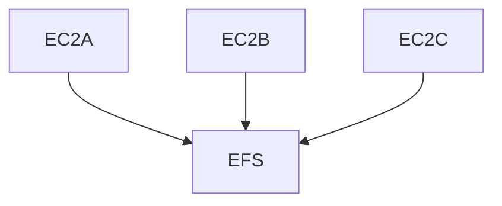

---

# 27. FSx

高性能なManaged File System。

Windows File ServerやLustreなど用途特化型。

---

# 28. Database

代表的なAWS Database。

```text
Relational
├─ RDS
└─ Aurora

NoSQL
└─ DynamoDB

Cache
└─ ElastiCache

Data Warehouse
└─ Redshift
```

---

# 29. RDS

Managed Relational Database。

対応例。

```text
PostgreSQL
MySQL
MariaDB
Oracle
SQL Server
```

AWSがBackupやMaintenanceなどを支援する。

---

# 30. Aurora

AWS独自のRelational Database。

MySQL / PostgreSQL互換。

高Availability / Scalabilityを重視。

---

# 31. DynamoDB

Serverless NoSQL Database。

Key-Value / Document Store。

```text
Partition Key
↓
Item
```

非常にスケールしやすい。

---

# 32. ElastiCache

Cache。

主にRedis / Memcached系。

```text
Application
↓
Cache hit
→ ElastiCache

Cache miss
→ Database
```

Database負荷を下げる。

---

# 33. DAX

DynamoDB Accelerator。

DynamoDB専用Cache。

---

# 34. Redshift

Data Warehouse。

大量データの分析用途。

OLTPではなくOLAP寄り。

---

# 35. IAM — Identity and Access Management

AWS Securityの中心。

考え方。

```text
誰が
何に対して
何をしていいか
```

---

# 36. IAM User / Role / Policy

```text
User
→ 人など

Role
→ 一時的に引き受ける権限

Policy
→ 許可内容
```

例。

```json
{
  "Effect": "Allow",
  "Action": [
    "ecr:GetAuthorizationToken"
  ],
  "Resource": "*"
}
```

---

# 37. Least Privilege

必要最低限の権限だけ与える。

```text
AdministratorAccess
```

を何でも付けるのではなく、

```text
ECR Pushに必要な権限
EKS Describeに必要な権限
State S3に必要な権限
```

だけ付ける。

今回GitHub ActionsでもRoleを分離した。

```text
GitHub Actions Deploy Role

GitHub Actions Terraform Plan Role
```

---

# 38. OIDC

今回かなり重要だった仕組み。

昔ありがちな構成。

```text
GitHub Secret
├─ AWS_ACCESS_KEY_ID
└─ AWS_SECRET_ACCESS_KEY
```

これは長期Credentialを保存する。

OIDCなら、

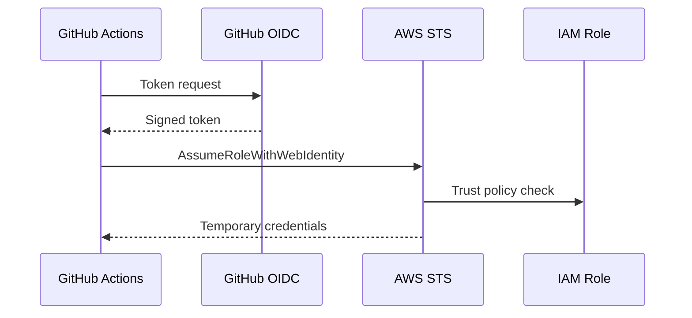

つまり、

```text
長期AWS Secret
不要

実行時だけ
Temporary Credential
```

になる。

---

# 39. OIDC Trust Policy

IAM Role側で、

```text
どのOIDC Providerから
どのRepository / Branchなら
Assume Roleしてよいか
```

を制限する。

今回GitHub側のsubject条件で一度詰まった。

これはSecurity上非常に重要。

---

# 40. WAF

Web Application Firewall。

Layer 7のHTTP攻撃対策。

例。

```text
SQL Injection
XSS
悪意あるRequest
```

---

# 41. Shield

DDoS対策。

AWS Shield Standardは基本的なDDoS保護を提供。

---

# 42. Network Firewall

VPC Network向けFirewall。

Deep Packet Inspectionなど。

複数VPCをTransit Gatewayで集約してFirewallを通す構成なども可能。

---

# 43. Transit Gateway

大量VPCをHub-and-Spoke型で接続する。

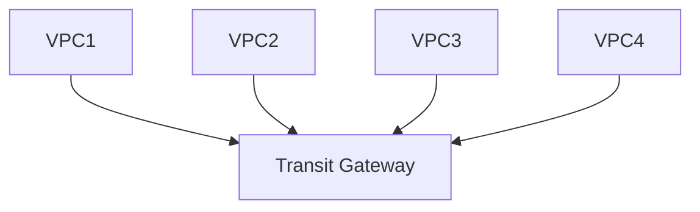

VPC Peeringを大量に張るより管理しやすい。

---

# 44. Direct Connect

On-PremiseとAWSを専用線で接続。

Internet経由VPNより安定した接続が必要な企業用途。

---

# 45. VPN

Internetを使って暗号化Tunnelを構築。

---

# 46. Availability Zone

AWS Regionの中に複数の独立したData Center群がある。

```text
ap-northeast-1
├─ ap-northeast-1a
├─ ap-northeast-1c
└─ ...
```

複数AZに分散することで障害耐性を上げる。

---

# 47. Multi-AZ

同じシステムを複数Availability Zoneに配置。

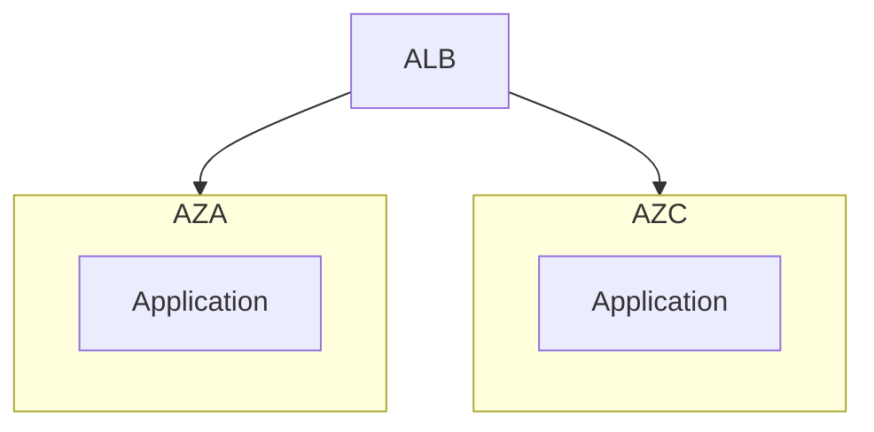

片方のAZが死んでももう片方で継続できる。

---

# 48. Disaster Recovery

代表的な考え方。

```text
Backup & Restore

Pilot Light

Warm Standby

Multi-Site Active/Active
```

下に行くほど復旧は速いがコストも高い。

---

# 49. Terraform

TerraformはInfrastructure as Codeツール。

AWS Consoleでポチポチする代わりに、

```hcl
resource "aws_vpc" "main" {
  cidr_block = "10.0.0.0/16"
}
```

と書く。

---

# 50. Infrastructure as Code

InfrastructureをCodeとして管理する。

メリット。

```text
再現可能
Review可能
Git管理可能
変更履歴
自動化
環境差分を減らせる
```

---

# 51. Terraform Desired State

Terraformは、

```text
現在のAWS

vs

Terraform Configuration
```

を比較する。

そして差分を埋める。

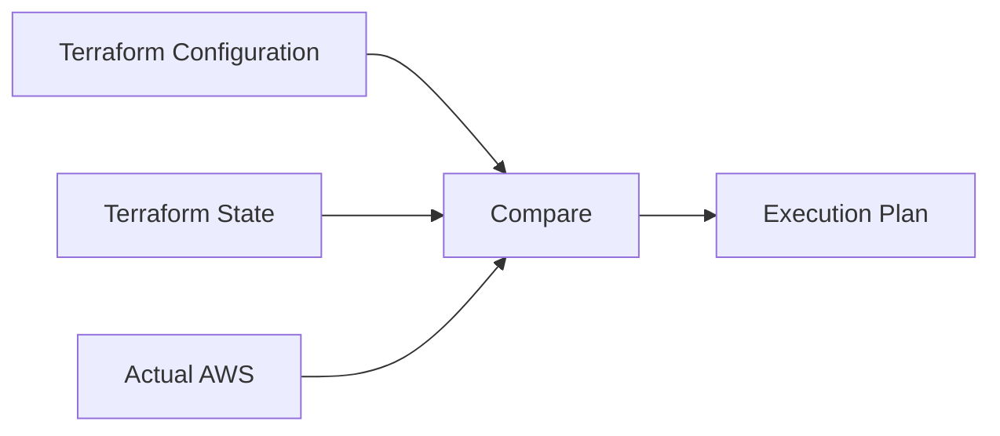

---

# 52. Provider

Terraformが外部サービスを操作するためのPlugin。

今回。

```hcl
provider "aws" {
  region = var.aws_region
}
```

---

# 53. Resource

Terraformが作成・管理する対象。

```hcl
resource "aws_ecr_repository" "frontend" {
  name = "aws-kubernetes-lab-frontend"
}
```

---

# 54. Data Source

既存情報を読む。

```text
作る
→ resource

読む
→ data
```

例。

```hcl
data "aws_availability_zones" "available" {}
```

---

# 55. Variable

外から変更したい値。

```hcl
variable "aws_region" {
  type = string
}
```

---

# 56. Output

Terraformが作った情報を外へ出す。

```hcl
output "cluster_name" {
  value = module.eks.cluster_name
}
```

---

# 57. Module

複数Resourceをまとめた再利用可能単位。

今回、

```text
terraform-aws-modules/vpc/aws

terraform-aws-modules/eks/aws
```

などを利用。

つまり、

```text
module "vpc"
```

一つ書くだけでも内部では、

```text
VPC
Subnet
Route Table
Internet Gateway
Security Group
...
```

など大量のResourceが作られる。

---

# 58. Terraform State

非常に重要。

Terraformは、

```text
このResourceは
AWS上のこのID
```

という対応をStateに持つ。

```text
Terraform Resource
aws_vpc.example

↓

State

↓

AWS
vpc-xxxx
```

StateがなければTerraformは自分が何を管理しているかわからなくなる。

---

# 59. Local State

最初は、

```text
terraform.tfstate
```

をLocalに保存できる。

問題。

```text
PC壊れる
複数人で共有できない
同時実行に弱い
CIから使いにくい
```

---

# 60. Remote State

StateをRemoteに置く。

今回、

```text
S3
└─ dev/terraform.tfstate
```

へ移行した。

---

# 61. S3 Backend

```hcl
terraform {
  backend "s3" {
    bucket       = "..."
    key          = "dev/terraform.tfstate"
    region       = "ap-northeast-1"
    use_lockfile = true
  }
}
```

これによって、

```text
Developer
     \
      → S3 Terraform State
     /
GitHub Actions
```

が可能になる。

---

# 62. State Lock

同時に2つのTerraformがStateを書き換えると危険。

```text
Developer A apply
Developer B apply

↓
State破壊の可能性
```

Lockによって、

```text
今誰か操作中
→ 他は待つ
```

にできる。

---

# 63. Terraform Commands

## init

```bash
AWS_PROFILE=eks-lab terraform init
```

Terraform Directoryを初期化。

```text
Provider Download
Module Download
Backend初期化
```

---

## fmt

```bash
terraform fmt
```

Formatting。

CI。

```bash
terraform fmt -check
```

---

## validate

```bash
terraform validate
```

Configurationとして有効か確認。

---

## plan

```bash
AWS_PROFILE=eks-lab terraform plan
```

何が変わるか見る。

最重要。

```text
+ create
~ update
- destroy
```

---

## apply

```bash
AWS_PROFILE=eks-lab terraform apply
```

Planを実行。

---

## destroy

```bash
AWS_PROFILE=eks-lab terraform destroy
```

Terraform管理Resourceを削除。

今回最終的に、

```text
67 resources destroyed
```

まで行った。

---

# 64. Terraformの基本Flow

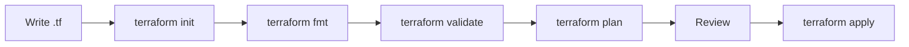

---

# 65. Drift

Terraform外からAWSを変更すると、

```text
Terraform State
≠
AWS Actual State
```

になる。

これをDriftという。

今回Managed Node Groupのdesired sizeをAWS CLI側から変更したことで、Terraformとの関係も確認した。

IaCでは、

```text
原則
Infrastructure変更
→ Terraform
```

に寄せる方がよい。

---

# 66. Terraform Import

既存ResourceをTerraform管理下へ入れる機能。

```text
AWS上に既にResource
↓
terraform import
↓
Stateへ登録
```

---

# 67. Terraform / CloudFormation / CDK

## Terraform

```text
HCL
Multi Cloud
Stateあり
```

## CloudFormation

```text
AWS Native
YAML / JSON
AWSとの統合が強い
```

## CDK

```text
TypeScript
Python
Java
などでInfrastructureを書く

↓
CloudFormationへ変換
```

イメージ。

```text
Terraform
→ Infrastructure Tool

CloudFormation
→ AWS Native IaC

CDK
→ Programming Language
→ CloudFormation
```

---

# 68. Kubernetes

KubernetesはContainer Orchestrator。

簡単にいうと、

```text
Containerを
どこで
何個
どう繋いで
どう復旧するか
```

を管理する。

---

# 69. Kubernetesの最重要思想

Desired State。

```yaml
replicas: 3
```

と書けば、

```text
現在2Pod
↓
Desired 3Pod
↓
1Pod追加
```

する。

1Pod削除しても、

```text
Desired = 3
Current = 2
↓
Controller
↓
新しいPod作成
```

される。

---

# 70. Reconciliation Loop

Kubernetesは常に、

```text
Desired State
vs
Current State
```

を比較する。

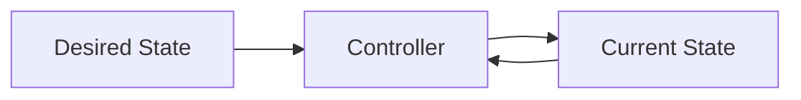

これがKubernetesの本質。

---

# 71. Cluster

Kubernetes全体。

```text
Cluster
├─ Control Plane
└─ Nodes
```

---

# 72. Control Plane

Clusterを管理する側。

代表Components。

```text
kube-apiserver
etcd
kube-scheduler
kube-controller-manager
```

---

# 73. kube-apiserver

Kubernetesの入口。

```text
kubectl
↓
API Server
↓
Kubernetes
```

ほぼすべての操作はAPI Serverを通る。

---

# 74. etcd

Cluster Stateを保存するKey-Value Store。

```text
Deployment情報
Pod情報
Config
Secret
...
```

を持つ。

---

# 75. Scheduler

PodをどのNodeへ置くか決める。

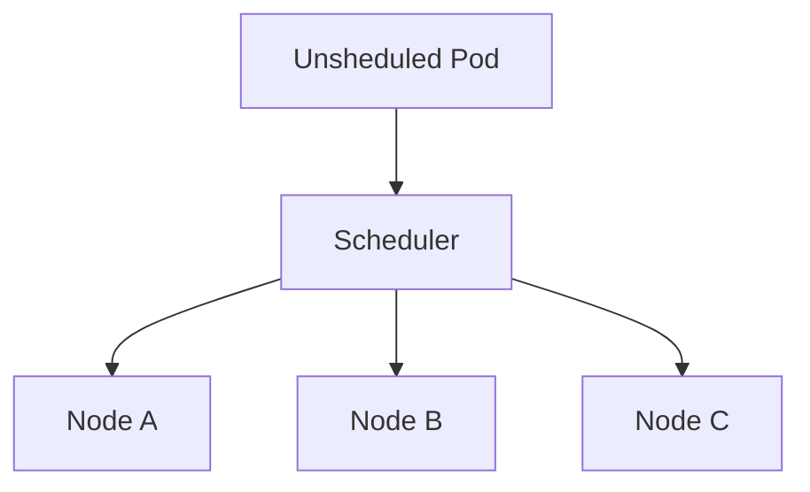

判断材料。

```text
CPU / Memory Requests
nodeSelector
Affinity
Anti-Affinity
Taint
Toleration
Topology
```

---

# 76. Controller Manager

Desired Stateを保つためのController群。

```text
Deployment Controller
ReplicaSet Controller
Node Controller
Job Controller
...
```

---

# 77. Node

Podが実際に動くMachine。

```text
Node
├─ kubelet
├─ Container Runtime
├─ kube-proxy
└─ Pods
```

---

# 78. kubelet

Node上でPodを動かすAgent。

```text
Control Plane
↓
kubelet
↓
Container Runtime
↓
Container
```

Liveness ProbeによるRestart判断にも関わる。

---

# 79. Pod

KubernetesでContainerを動かす最小Deploy単位。

重要。

```text
Pod
≠ Function

Pod
= 1つ以上のContainerをまとめた実行単位
```

通常、

```text
1 Application Container
=
1 Pod
```

が多い。

---

# 80. ContainerとPod

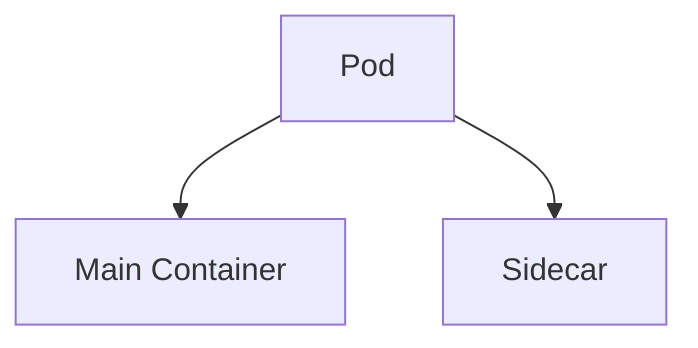

同じPod内では、

```text
Network Namespace共有
Volume共有可能
同じLifecycle
```

---

# 81. ReplicaSet

指定されたPod数を維持する。

```text
replicas = 3
```

なら3Pod。

ただ通常ReplicaSetを直接触らずDeploymentが管理する。

---

# 82. Deployment

Stateless Applicationの基本Controller。

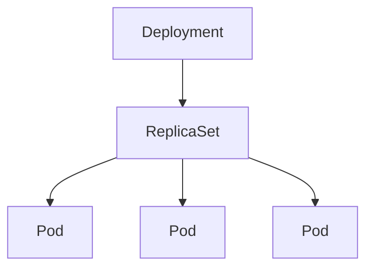

Deploymentが主に担当。

```text
replicas
Rolling Update
Rollback
ReplicaSet管理
```

---

# 83. Deployment → ReplicaSet → Pod

これは最重要。

```text
Deployment
↓
ReplicaSet
↓
Pod
```

Podを直接消してもReplicaSetが復元する。

ReplicaSetをDeploymentが管理する。

---

# 84. Service

PodへのStable Network Endpoint。

Podは作り直されるとIPが変わる。

```text
Pod A
10.0.1.10

削除

Pod B
10.0.2.32
```

そのためClientがPod IPを直接使うのは困る。

Serviceを挟む。

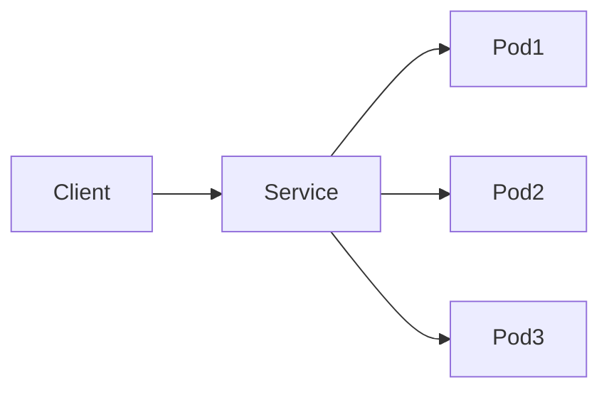

---

# 85. Selector / Label

ServiceはPod名で探さない。

Labelで探す。

Pod。

```yaml
labels:
  app: backend
```

Service。

```yaml
selector:
  app: backend
```

つまり、

```text
Service
↓
selector app=backend
↓
該当Pod
```

---

# 86. EndpointSlice

Serviceの実際の接続先情報。

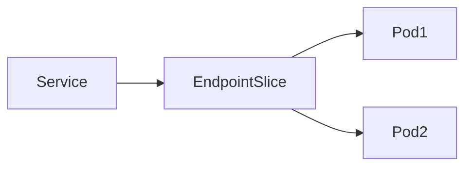

Serviceに繋がらない時は、

```bash
kubectl get endpointslice
```

を見る。

---

# 87. ClusterIP

Cluster内部用Service。

```text
Cluster内
Pod
↓
Service
↓
Pod
```

外からは基本アクセスできない。

---

# 88. Ingress

HTTP / HTTPS Routing Rule。

```yaml
/api
→ backend-service

/
→ frontend-service
```

ただしIngress Resourceだけでは動かない。

Ingress Controllerが必要。

---

# 89. Ingress Controller

Ingress Resourceを実際に処理するController。

kindではIngress NGINXを使った。

EKSではAWS Load Balancer Controllerを使った。

---

# 90. Ingress通信Flow

```mermaid
flowchart LR
    Client --> Ingress
    Ingress --> Controller
    Controller --> Service
    Service --> EndpointSlice
    EndpointSlice --> Pod
```

EKSでは、

```mermaid
flowchart LR
    Internet --> ALB
    ALB --> Ingress
    Ingress --> Service
    Service --> Pod
```

となった。

---

# 91. ConfigMap

Secretではない設定を保存。

```text
API_URL
LOG_LEVEL
FEATURE_FLAG
```

など。

Podへ、

```text
Environment Variable
Volume
```

として渡せる。

---

# 92. Secret

PasswordやTokenなどを保存。

ただし重要。

```text
Kubernetes Secret
≠ Secret Vault
```

単にSecret Resourceに入れただけで完全安全になるわけではない。

本番なら、

```text
Encryption at Rest
RBAC
Secrets Manager
External Secrets
```

なども検討する。

---

# 93. Namespace

Kubernetes ResourceのLogical Boundary。

```text
default
dev
staging
production
```

同じResource名でもNamespaceが違えば共存できる。

ただし、

```text
Namespace
≠ Network Isolation
```

Network isolationにはNetworkPolicyなどが必要。

---

# 94. Readiness Probe

そのPodへTrafficを流していいか。

```text
Readiness OK
→ Service Endpointに含める

Readiness NG
→ Service Endpointから外す
```

---

# 95. Liveness Probe

Applicationが死んでいないか。

```text
Liveness NG
↓
kubelet
↓
Container Restart
```

---

# 96. Readiness vs Liveness

```text
readiness
→ Trafficを受けられる？

liveness
→ Restartすべき？
```

この違いは重要。

---

# 97. Startup Probe

起動に時間がかかるApplication向け。

起動中にLivenessが誤判定してRestart Loopするのを防げる。

---

# 98. Requests

Podが必要とするResource量。

```yaml
resources:
  requests:
    cpu: 100m
    memory: 128Mi
```

SchedulerはRequestsを見て配置を決める。

---

# 99. Limits

Podが使用できる上限。

```yaml
limits:
  cpu: 500m
  memory: 256Mi
```

---

# 100. CPU Limit

CPUを超えると基本Throttlingされる。

今回低いCPU Limitを設定し、

```text
CPU Usage
→ 約Limit付近
```

になる挙動を確認した。

---

# 101. Memory Limit

Memory Limit超過では、

```text
OOMKilled
```

される可能性がある。

実際にMemory 32Mi制限で、

```text
OOMKilled
Exit Code 137
CrashLoopBackOff
```

を確認した。

---

# 102. QoS Class

KubernetesのResource設定によるClass。

```text
Guaranteed
Burstable
BestEffort
```

---

# 103. HPA — Horizontal Pod Autoscaler

負荷に応じてPod数を増減する。

```mermaid
flowchart LR
    Metrics[Metrics Server]
    Metrics --> HPA
    HPA --> Deployment
    Deployment --> ReplicaSet
    ReplicaSet --> Pods
```

実際に、

```text
min = 2
max = 6
CPU target = 50%
```

を設定。

Loadをかけて、

```text
2 Pods
↓
5 Pods
```

まで増えることを確認した。

---

# 104. Metrics Server

HPAなどがCPU / Memory Metricsを見るために利用。

kindでは最初、

```text
metrics unavailable
```

になった。

Metrics Serverを導入。

その後Local kind特有のTLS SAN問題があり、

```text
--kubelet-insecure-tls
```

で検証した。

これはLocal Lab用。

本番で安易に使わない。

---

# 105. PersistentVolume

Storageの実体をKubernetes側から表現。

```text
PV
→ Storage
```

---

# 106. PersistentVolumeClaim

Application側からのStorage要求。

```yaml
resources:
  requests:
    storage: 1Gi
```

---

# 107. PVC / PV

```mermaid
flowchart LR
    Pod --> PVC
    PVC --> PV
    PV --> Storage
```

Applicationは「このDisk IDを使う」と直接指定するのではなく、

```text
1Gi
RWO
このStorageClass
```

のように要求する。

---

# 108. StorageClass

StorageをどうProvisioningするか決める。

kindではLocal Path Provisioner。

EKSではEBS CSI。

---

# 109. Dynamic Provisioning

```text
PVC作成
↓
StorageClass
↓
Provisioner
↓
PV作成
↓
Physical Storage作成
```

---

# 110. StatefulSet

Stateful Application向け。

Deploymentとの大きな違い。

```text
Stable Name
Stable Identity
個別PVC
順序
```

Pod。

```text
postgres-0
postgres-1
postgres-2
```

---

# 111. StatefulSet + PVC

```mermaid
flowchart TD
    STS[StatefulSet]

    Pod0[postgres-0]
    Pod1[postgres-1]
    Pod2[postgres-2]

    PVC0[PVC 0]
    PVC1[PVC 1]
    PVC2[PVC 2]

    STS --> Pod0
    STS --> Pod1
    STS --> Pod2

    Pod0 --> PVC0
    Pod1 --> PVC1
    Pod2 --> PVC2
```

Podを消して再作成してもStorageは残った。

---

# 112. Headless Service

StatefulSetでStable DNSなどを実現するときによく使う。

```yaml
clusterIP: None
```

PodごとにDNSで参照できる。

---

# 113. Job

一回だけ実行する処理。

```mermaid
flowchart LR
    Job --> Pod
    Pod --> Complete
```

例。

```text
Migration
One-shot Batch
Database initialization
```

---

# 114. CronJob

ScheduleされたJob。

```mermaid
flowchart LR
    CronJob --> Job
    Job --> Pod
    Pod --> Completed
```

---

# 115. DaemonSet

各Nodeに1Podずつ配置。

```mermaid
flowchart TD
    DaemonSet --> NodeA
    DaemonSet --> NodeB
    DaemonSet --> NodeC

    NodeA --> PodA
    NodeB --> PodB
    NodeC --> PodC
```

代表例。

```text
Logging Agent
Monitoring Agent
CNI
Storage Driver
```

---

# 116. Workload Resourceの関係

```mermaid
flowchart TD
    Deployment --> ReplicaSet
    ReplicaSet --> DeploymentPod[Pod]

    StatefulSet --> StatefulPod[Pod]

    DaemonSet --> DaemonPod[Pod per Node]

    CronJob --> Job
    Job --> JobPod[Pod]
```

---

# 117. Rolling Update

Deploymentを新Versionに変更。

```text
Old ReplicaSet
↓
New ReplicaSet
```

少しずつPodを入れ替える。

---

# 118. Rollback

問題があれば以前のRevisionへ戻せる。

```bash
kubectl rollout undo deployment/<name>
```

実際に存在しないnginx imageへ変更し、

```text
ErrImagePull
ImagePullBackOff
```

にした。

Deploymentは古い正常Podを残し、Rolloutが停止した。

その後Rollbackして復旧。

---

# 119. nodeSelector

特定LabelのNodeだけに配置。

```yaml
nodeSelector:
  architecture: arm64
```

条件に合うNodeがなければPodはPending。

---

# 120. Affinity

より柔軟なPlacement rule。

```text
required
→ 必須

preferred
→ できれば
```

---

# 121. Anti-Affinity

Pod同士を離す。

```text
同じNodeに同じApplicationを置きたくない
```

場合など。

Multi-node kind Clusterで、

```text
Pod A → Worker 1
Pod B → Worker 2
Pod C → Pending
```

も確認した。

---

# 122. Taint

Node側から、

```text
普通のPod来ないで
```

とする仕組み。

例。

```text
dedicated=gpu:NoSchedule
```

---

# 123. Toleration

Pod側で、

```text
そのTaintを許容できます
```

と宣言する。

重要。

```text
Toleration
≠ そのNodeへ必ず行く
```

「置いてもいい」だけ。

---

# 124. Taint Effects

代表的。

```text
NoSchedule
PreferNoSchedule
NoExecute
```

`NoSchedule` は基本的に既存Podを追い出さず、新規Schedulingを防ぐ。

---

# 125. Scheduling Flow

```mermaid
flowchart TD
    Pod[Pending Pod]
    Scheduler[Scheduler]

    Requests[CPU Memory Requests]
    Selector[nodeSelector]
    Affinity[Affinity]
    Taints[Taints/Tolerations]
    Spread[Topology / Anti-Affinity]

    Pod --> Scheduler

    Requests --> Scheduler
    Selector --> Scheduler
    Affinity --> Scheduler
    Taints --> Scheduler
    Spread --> Scheduler

    Scheduler --> Node[Selected Node]
    Node --> Kubelet
    Kubelet --> RunningPod[Running Pod]
```

---

# 126. NetworkPolicy

Pod間通信を制御。

```text
frontend
→ backend

backend
→ database

その他
→ deny
```

のようなZero Trust寄りの構成が可能。

---

# 127. NetworkPolicyの重要ポイント

複数NetworkPolicyは基本的に加算的。

```text
Policy Aでallow
+
Policy Bでallow
```

許可集合のUnionになる。

---

# 128. IngressとNetworkPolicyは別物

名前が紛らわしい。

```text
Ingress Resource
→ HTTP Routing

NetworkPolicy ingress rule
→ PodへのNetwork通信制御
```

---

# 129. ServiceAccount

PodのKubernetes上のIdentity。

```text
Pod
↓
ServiceAccount
↓
RBAC
```

---

# 130. RBAC

Role Based Access Control。

```mermaid
flowchart LR
    Pod --> SA[ServiceAccount]
    SA --> Binding[RoleBinding]
    Binding --> Role
    Role --> API[Kubernetes API]
```

---

# 131. Role

Namespace内のPermission。

今回、

```text
pods

get
list
watch
```

を許可。

```text
delete
```

は拒否されることを確認した。

---

# 132. ClusterRole

Cluster-wideなRole。

---

# 133. RoleBinding

Roleを、

```text
User
Group
ServiceAccount
```

へ結びつける。

---

# 134. Kubernetes RBACとAWS IAM

別物。

```text
AWS IAM
→ AWS APIへの権限

Kubernetes RBAC
→ Kubernetes APIへの権限
```

EKSではこの2つが繋がる場面がある。

---

# 135. EKS

EKSはManaged Kubernetes。

Local kindとの対応。

```text
kind Control Plane
→ EKS Managed Control Plane

kind Worker Node
→ EC2 Managed Node Group

Local Storage
→ EBS

Ingress NGINX
→ AWS Load Balancer Controller + ALB
```

---

# 136. EKS Architecture

```mermaid
flowchart TD
    AWS[AWS]

    Control[EKS Managed Control Plane]

    NodeGroup[Managed Node Group]
    Node1[EC2 Node]
    Node2[EC2 Node]

    Control --> NodeGroup
    NodeGroup --> Node1
    NodeGroup --> Node2

    Node1 --> Pods1[Pods]
    Node2 --> Pods2[Pods]
```

---

# 137. Managed Node Group

AWSがEKS Worker Node lifecycleを管理しやすくしてくれる。

今回。

```text
Instance Type = t3.small
min = 1
max = 2
desired = 2
```

---

# 138. EKS Add-ons

今回使ったもの。

```text
VPC CNI
kube-proxy
CoreDNS
EKS Pod Identity Agent
EBS CSI Driver
```

---

# 139. VPC CNI

Pod NetworkをAWS VPCへ統合する。

NodeがReadyにならなかった時にCNIの重要性を実体験した。

```text
Node
↓
CNI
↓
Pod Network
```

CNIが正常でないとPod Networkingが成立しない。

---

# 140. CoreDNS

Kubernetes内部DNS。

```text
backend
↓
CoreDNS
↓
backend Service
```

Service名で通信できるのはCoreDNSのおかげ。

---

# 141. kube-proxy

Service Networkingを実現するComponent。

---

# 142. Kubernetes DNS

同じNamespaceなら、

```text
backend
```

などでServiceへアクセスできる。

FQDNなら、

```text
backend.default.svc.cluster.local
```

のようになる。

---

# 143. CSI — Container Storage Interface

KubernetesとStorage Providerを繋ぐStandard Interface。

EKSでは、

```text
Kubernetes PVC
↓
EBS CSI Driver
↓
AWS EBS
```

を使った。

---

# 144. EBS CSI Driver

```mermaid
flowchart LR
    Pod --> PVC
    PVC --> StorageClass
    StorageClass --> EBSCSI[EBS CSI Driver]
    EBSCSI --> EBS
```

---

# 145. Pod Identity

PodにAWS Permissionを与える仕組み。

考え方。

```text
Pod
↓
ServiceAccount
↓
Pod Identity Association
↓
IAM Role
↓
AWS API
```

EBS CSIやAWS Load Balancer Controllerに利用した。

---

# 146. AWS Load Balancer Controller

Kubernetes Ingressなどを監視してAWS ALB / NLBを作るController。

```mermaid
flowchart LR
    Ingress[Kubernetes Ingress]
    Controller[AWS Load Balancer Controller]
    AWS[AWS API]
    ALB[ALB]

    Ingress --> Controller
    Controller --> AWS
    AWS --> ALB
```

---

# 147. Ingressを作るだけではALBはできない

必要なのは、

```text
Ingress Resource

+

AWS Load Balancer Controller

+

ControllerのAWS IAM権限
```

---

# 148. AWS Load Balancer Controllerで踏んだ問題

Helm install時、

```text
serviceAccount.create=false
```

にしていた。

しかしServiceAccount自体が存在せず、

```text
ReplicaSet FailedCreate
```

になった。

ServiceAccountを作成するとControllerが起動。

ここから、

```text
IAM Roleがあっても
Kubernetes側Identityがなければ繋がらない
```

ことが分かった。

---

# 149. PostgreSQL on Kubernetes

今回LabではPostgreSQLもEKS内で動かした。

```mermaid
flowchart TD
    Backend --> PostgresService[Postgres Service]
    PostgresService --> PostgresPod[postgres-0]
    PostgresPod --> PVC
    PVC --> EBS
```

本番ではRDS / AuroraへDatabaseを外出しする構成も非常に一般的。

---

# 150. PostgreSQLとlost+found

EBS VolumeをfilesystemとしてMountした時、

root directoryに、

```text
lost+found
```

が存在した。

PostgreSQLは空Directoryを期待するため問題になった。

そこで、

```text
PGDATA=/var/lib/postgresql/data/pgdata
```

のようにSubdirectoryを使った。

---

# 151. PostgreSQL Init Script

```text
/docker-entrypoint-initdb.d/
```

へSQLを置くと初回Database作成時に実行される。

重要。

```text
初回だけ
```

なので既存PVCでは再実行されない。

---

# 152. ECR — Elastic Container Registry

Docker Image Registry。

```text
Docker Build
↓
ECR Push
↓
EKS Pull
↓
Pod
```

---

# 153. Mac arm64問題

MacがARM64。

EKS Worker Nodeはx86_64。

普通にBuildするとArchitectureが合わない可能性がある。

そこで、

```bash
docker buildx build \
  --platform linux/amd64 \
  ...
```

を利用。

---

# 154. Docker Image Architecture

```text
Mac
arm64

EKS Node
amd64

↓
Image Architectureを合わせる必要
```

Multi-platform imageも選択肢。

---

# 155. GitHub Actions

GitHub Repository上でWorkflowを実行するCI/CD。

```text
git push
↓
GitHub Actions
↓
Test
↓
Build
↓
Push
↓
Deploy
```

---

# 156. CIとCD

## CI

Continuous Integration。

```text
Code変更
↓
Build
Test
Lint
Validate
```

## CD

Continuous Delivery / Deployment。

```text
CI成功
↓
Deployment
```

---

# 157. Terraform CI

今回Terraform用Workflowでは、

```text
terraform init
terraform fmt -check
terraform validate
terraform plan
```

をGitHub Actionsで実行。

```mermaid
flowchart LR
    Push --> GHA[GitHub Actions]
    GHA --> Init[terraform init]
    Init --> Fmt[fmt -check]
    Fmt --> Validate
    Validate --> Plan
```

---

# 158. Application Deploy CI/CD

```mermaid
flowchart LR
    Push --> Actions
    Actions --> Build
    Build --> ECR
    Actions --> Kubeconfig
    Kubeconfig --> EKS
    EKS --> Rollout
```

Frontend / Backendの変更時だけDeploy Workflowを実行するようpaths filterも設定。

README変更だけでApplication Deployが走らないよう責務を分離した。

---

# 159. GitHub Actions OIDC

Workflow。

```text
GitHub Actions
↓
OIDC Token
↓
AWS STS
↓
IAM Role
↓
Temporary Credentials
```

長期Access KeyをRepository Secretに保存しない。

---

# 160. IAM Roleを分離した理由

Deploy。

```text
ECR Push
EKS Deploy
```

Terraform Plan。

```text
AWS Read
S3 State access
```

必要権限が違う。

そのため、

```text
Deploy Role

Terraform Plan Role
```

を分離。

Least Privilegeに近づく。

---

# 161. TerraformでLocal ProfileをHardcodeしない

最初Provider側に、

```hcl
profile = "eks-lab"
```

があった。

これはLocalでは動く。

でもGitHub ActionsにはそのLocal Profileが存在しない。

そのためProviderからprofile依存を削除。

Local。

```bash
AWS_PROFILE=eks-lab terraform plan
```

CI。

```text
OIDC
↓
Environment Credentials
↓
Terraform AWS Provider
```

---

# 162. Local AuthenticationとCI Authentication

```text
Local
└─ AWS_PROFILE=eks-lab

GitHub Actions
└─ OIDC
   └─ IAM Role
      └─ Temporary Credentials
```

同じTerraform Codeを使える。

---

# 163. Troubleshootingの基本思想

Kubernetesでは、

```text
推測
```

より、

```text
Stateを見る
Eventsを見る
Logsを見る
```

が大事。

基本。

```text
get
↓
describe
↓
logs
↓
exec
```

---

# 164. kubectl get

現在の一覧 / 状態。

```bash
kubectl get pods
kubectl get deployment
kubectl get service
kubectl get pvc
kubectl get nodes
```

---

# 165. kubectl describe

詳細とEvents。

```bash
kubectl describe pod <pod>
```

かなり重要。

特に、

```text
Pending
ImagePullBackOff
FailedCreate
Mount error
Probe error
```

はEventsを見る。

---

# 166. kubectl logs

Application Log。

```bash
kubectl logs <pod>
```

前回CrashしたContainer。

```bash
kubectl logs <pod> --previous
```

CrashLoopBackOffで重要。

---

# 167. kubectl exec

Pod内部でCommand実行。

```bash
kubectl exec -it <pod> -- sh
```

内部から、

```text
DNS
Environment Variable
File
Network
```

を確認できる。

---

# 168. kubectl events

Cluster Eventを確認。

```bash
kubectl get events
```

---

# 169. ImagePullBackOff

意味。

```text
Container Imageを取得できない
```

まず。

```bash
kubectl describe pod <pod>
```

見るもの。

```text
Image名
Tag
Registry
Permission
Architecture
```

---

# 170. CrashLoopBackOff

Container起動。

```text
起動
↓
Crash
↓
Restart
↓
Crash
```

まず。

```bash
kubectl logs <pod>
kubectl logs <pod> --previous
kubectl describe pod <pod>
```

---

# 171. Pod Running 0/1

Processは動いているがReadyではない可能性。

典型。

```text
Readiness Probe失敗
```

確認。

```bash
kubectl describe pod <pod>
```

---

# 172. Pod Pending

Schedulerが配置できない。

確認。

```bash
kubectl describe pod <pod>
```

候補。

```text
CPU不足
Memory不足
nodeSelector不一致
Affinity不一致
Taint
PVC
```

---

# 173. OOMKilled

Memory Limitを超えた。

確認。

```bash
kubectl describe pod <pod>
```

```text
Reason: OOMKilled
Exit Code: 137
```

---

# 174. Serviceに繋がらない

見る順。

```text
Service selector
↓
Pod labels
↓
EndpointSlice
↓
targetPort
↓
Pod listen port
```

コマンド。

```bash
kubectl get svc
kubectl describe svc <service>
kubectl get endpointslice
kubectl get pods --show-labels
```

---

# 175. Connection Refused

意味としては、

```text
相手Hostまでは届いた
でもそのPortでProcessがListenしていない
```

可能性が高い。

見る。

```text
containerPort
Service targetPort
Application Listen Port
```

---

# 176. Timeout

候補。

```text
NetworkPolicy
Security Group
Route
Application hang
Firewall
Wrong destination
```

---

# 177. NXDOMAIN

DNSで名前解決できない。

```text
Service名間違い
Namespace違い
CoreDNS
```

確認。

```bash
kubectl get svc
kubectl get pods -n kube-system
```

---

# 178. PVC Pending

```text
StorageClass
Provisioner
CSI Driver
Topology
```

を見る。

```bash
kubectl describe pvc <pvc>
kubectl get storageclass
kubectl get pv
```

---

# 179. ErrImagePullからRollback

実際に、

```text
存在しないnginx Image
```

を設定。

結果。

```text
ErrImagePull
↓
ImagePullBackOff
↓
Rollout停止
↓
Old Pod維持
```

その後。

```bash
kubectl rollout undo deployment/<name>
```

で復旧。

---

# 180. Readiness Probe Experiment

わざと失敗するPathを指定。

```text
Pod
Running
0/1
```

EndpointSlice。

```text
ready=false
```

ServiceはそのPodへTrafficを流さなくなった。

つまり、

```text
Readiness Probe
↓
EndpointSlice
↓
Service Routing
```

が繋がっている。

---

# 181. Liveness Probe Experiment

わざと404になるPathへ設定。

```text
Probe Failure
↓
threshold到達
↓
Container Restart
```

Restart Countが増加。

---

# 182. NetworkPolicy Experiment

まずdeny。

```text
Client
X
API Pod
```

その後許可Policy。

```text
特定LabelのPod
↓
API
```

のみ通信可能にした。

---

# 183. RBAC Experiment

ServiceAccountに、

```text
pods
get/list/watch
```

のみ許可。

確認。

```bash
kubectl auth can-i list pods
```

結果。

```text
yes
```

delete。

```text
no
```

Deployments。

```text
no
```

別Namespace。

```text
no
```

---

# 184. Multi-node Kubernetes Experiment

kindで3Node。

```text
Control Plane
Worker 1
Worker 2
```

全Node Ready。

Affinity / Anti-Affinity / Taintを実験した。

---

# 185. Preferred Affinity

あるZone Labelをpreferredにすると、

```text
可能ならそこへ配置
```

される。

必須ではない。

---

# 186. Required Anti-Affinity

同じhostnameへの配置を禁止。

Workerが2台しか使えない状態で3Pod必要になると、

```text
Pod1 → Worker1
Pod2 → Worker2
Pod3 → Pending
```

となった。

---

# 187. Control Plane Taint

Control Plane Nodeには通常Scheduling防止Taintがある。

そのため3つ目のPodが置けなかった。

Tolerationを追加するとControl Plane Nodeへも置ける。

---

# 188. Anti-AffinityとRolling Update Deadlock

これも重要な経験。

Anti-Affinityで、

```text
1 Node 1 Pod
```

を強制。

Deployment Rolling Updateで、

```text
maxSurge > 0
```

だと新Podを追加したい。

しかし全Node埋まっている。

```text
Old Pod
Old Pod
Old Pod

新Pod
→ 置く場所なし
```

そこで、

```text
maxSurge: 0
maxUnavailable: 1
```

へ変更。

```text
Oldを1つ消す
↓
場所が空く
↓
Newを置く
```

ことで解消。

---

# 189. EKS Node NotReady

EKS構築中にNodeが正常にならない問題があった。

Kubernetes Nodeは単にEC2が起動しているだけでは足りない。

```text
EC2
+
kubelet
+
CNI
+
Cluster接続
```

などが成立して初めてReady。

VPC CNI / kube-proxy / CoreDNSなどAdd-onの重要性を確認した。

---

# 190. EBS CSI Pod Identity Association Error

Terraform再実行中に、

```text
ResourceInUseException
Association already exists
```

が発生。

つまり、

```text
Terraform側
→ 作ろうとしている

AWS側
→ 既に存在
```

というState / Actual Resourceの不整合系。

不要なAssociationを確認して削除し再実行。

IaCでは、

```text
Configuration
State
Actual Infrastructure
```

の3つを意識する。

---

# 191. AWS Load Balancer Controller FailedCreate

原因。

```text
Helm
serviceAccount.create=false

+

ServiceAccountなし
```

Podが作れない。

対処。

```text
ServiceAccount作成
↓
Pod Identity Associationが紐づく
↓
Controller起動
```

---

# 192. ALB Debug

Ingressを作ってもALBが出ない場合。

```text
Ingress
↓
AWS Load Balancer Controller
↓
ServiceAccount
↓
Pod Identity / IAM
↓
AWS API
↓
Subnet Tags
↓
ALB
```

全部見る。

---

# 193. EKS Application Flow

最終的なRequest。

```mermaid
sequenceDiagram
    participant U as User
    participant A as ALB
    participant I as Ingress
    participant F as Frontend Service
    participant FP as Frontend Pod
    participant B as Backend Service
    participant BP as Backend Pod
    participant DB as PostgreSQL
    participant E as EBS

    U->>A: HTTP Request
    A->>I: Route
    I->>F: /
    F->>FP: Load Balance
    FP->>B: API Request
    B->>BP: Route
    BP->>DB: SQL
    DB->>E: Persistent Data
```

---

# 194. Terraform State Flow

```mermaid
flowchart TD
    TF[Terraform CLI]
    Config[Terraform Config]
    State[S3 Remote State]
    AWS[AWS]

    Config --> TF
    State --> TF
    AWS --> TF

    TF --> Plan
    Plan --> Apply
    Apply --> AWS
    Apply --> State
```

---

# 195. GitHub Actions Deploy Flow

```mermaid
sequenceDiagram
    participant Dev as Developer
    participant GH as GitHub
    participant OIDC as GitHub OIDC
    participant AWS as AWS STS
    participant ECR as ECR
    participant EKS as EKS

    Dev->>GH: git push
    GH->>OIDC: Request token
    OIDC-->>GH: OIDC token
    GH->>AWS: Assume IAM Role
    AWS-->>GH: Temporary credentials

    GH->>ECR: Push frontend image
    GH->>ECR: Push backend image

    GH->>EKS: kubectl set image
    EKS->>ECR: Pull new images
    EKS->>EKS: Rolling Update
```

---

# 196. GitHub Actions Workflow分離

Application Deploy。

```text
frontend/**
backend/**
deploy.yml
```

変更時。

Terraform。

```text
terraform/**
terraform.yml
```

変更時。

これにより、

```text
README更新
↓
Application Build
```

のような不要CIを避ける。

---

# 197. Secretsの扱い

Gitへ本物のSecretをCommitしない。

今回。

```text
postgres-secret.example.yaml
→ Git管理

postgres-secret.yaml
→ .gitignore
```

`.gitignore`。

```gitignore
*-secret.yaml
!*-secret.example.yaml
```

---

# 198. Terraform StateをGitへ入れない

```text
terraform.tfstate
terraform.tfstate.backup
.terraform/
tfplan
```

などは基本Git管理しない。

ただし、

```text
.terraform.lock.hcl
```

はGit管理する。

これはProvider Version reproducibilityに重要。

---

# 199. `.terraform.lock.hcl`

Provider dependency lock。

```text
AWS Provider Version
Hash
```

などを固定。

Node.jsの、

```text
package-lock.json
```

に近いイメージ。

---

# 200. ApplicationとInfrastructureの責務

```text
Application Code
↓
Docker Image
↓
ECR
↓
Kubernetes Deployment

Infrastructure
↓
Terraform
↓
AWS
```

Application変更でTerraformを回す必要は基本ない。

Infrastructure変更でApplication ImageをBuildする必要も基本ない。

---

# 201. Kubernetes ManifestとTerraformの境界

今回の基本方針。

Terraform。

```text
AWS Infrastructure

VPC
EKS
ECR
IAM
OIDC
```

Kubernetes YAML。

```text
Deployment
Service
Ingress
StatefulSet
NetworkPolicy
HPA
RBAC
```

---

# 202. Terraform destroy

IaCの強みは作るだけではない。

```text
terraform apply
→ 作る

terraform destroy
→ 片付ける
```

---

# 203. AWS削除で順番が重要なもの

External ResourceがあるとVPCなどが消えないことがある。

今回。

```text
Ingress
↓
ALB

PVC
↓
PV
↓
EBS

Load Balancer Controller

ECR Images

Terraform Resources

S3 State Bucket
```

の順で片付けた。

---

# 204. ALB削除

まずIngressを削除。

```bash
kubectl delete -f kubernetes/full-app/networking/ingress.yaml
```

ControllerがAWS ALBも削除。

確認。

```bash
aws elbv2 describe-load-balancers \
  --region ap-northeast-1 \
  --profile eks-lab
```

---

# 205. PVC削除でTerminating

PVCを削除。

```bash
kubectl delete pvc postgres-data-postgres-0
```

しかし、

```text
Terminating
```

で止まった。

理由。

```text
postgres-0
↓
まだPVC使用中
```

StatefulSetを削除。

```bash
kubectl delete statefulset postgres
```

Podが消える。

```text
PVC Protection解除
↓
PVC削除
↓
PV削除
↓
EBS削除
```

---

# 206. PVC Protection

使用中PVCを誤って削除してData lossしないようKubernetesが保護する。

```text
PVC delete request
↓
Podが使用中
↓
Terminating
↓
Pod終了
↓
PVC削除
```

---

# 207. EBS確認

`kubectl get pv` が空になったあとAWS EBSを確認。

残っていた20GB x2は、

```text
State = in-use
Name = lab
```

だった。

これはPostgreSQL 1Gi EBSではなくEKS Worker NodeのRoot Volume。

手動削除せずNode Group destroyに任せた。

---

# 208. ECR削除

RepositoryにImageが残っているとRepository削除が失敗する可能性がある。

そのため、

```text
frontend image
backend image
```

を削除。

さらにBuildx由来のuntagged Image Digestも残っていたため二度削除。

---

# 209. Untagged ECR Image

Tagを消してもImage Manifestなどが残る場合がある。

```bash
aws ecr list-images ...
```

で、

```json
{
  "imageDigest": "sha256:..."
}
```

だけのEntryを確認。

それも削除した。

---

# 210. Terraform Destroy結果

```text
Plan:
0 to add
0 to change
67 to destroy
```

を実行。

最終的にTerraform State上のInfrastructureは空になった。

その後 `terraform plan` すると、

```text
67 to add
0 to change
0 to destroy
```

になった。

これは正常。

```text
Configuration
→ Infrastructure欲しい

State
→ 何もない

AWS
→ 何もない

結果
→ 67個作るPlan
```

---

# 211. Destroy後の確認

EKS。

```bash
aws eks list-clusters \
  --region ap-northeast-1 \
  --profile eks-lab
```

結果。

```json
{
  "clusters": []
}
```

ALB。

```json
{
  "LoadBalancers": []
}
```

EC2。

```text
terminated
terminated
```

まで確認した。

---

# 212. S3 State Bucket削除

Remote State BucketはTerraform管理外で先に作っていた。

そのためTerraform Destroyでは消えない。

さらにVersioning有効。

単純にObjectを消すだけではBucketは空にならない。

```text
Current Object
Historical Version
Delete Marker
```

全部消す必要がある。

---

# 213. S3 Versioning

Versioning有効。

```text
terraform.tfstate
├─ Version A
├─ Version B
├─ Version C
└─ Latest
```

通常DeleteするとDelete Markerが作られる。

完全削除時はVersion ID指定で削除する。

---

# 214. Bucket完全削除

最終的に、

```bash
aws s3api head-bucket ...
```

で、

```text
404 Not Found
```

を確認。

これでState Bucketも削除完了。

---

# 215. KMS Key削除

KMS Keyは通常Terraform Destroy時に即時物理削除ではなく、

```text
Scheduled for deletion
```

になることがある。

これはKMSの安全機構。

---

# 216. Kubernetes診断フローチャート

```mermaid
flowchart TD
    Start[Podがおかしい]

    Running{STATUSは?}

    Pending[Pending]
    Crash[CrashLoopBackOff]
    Image[ImagePullBackOff]
    RunningState[Running]

    Start --> Running

    Running -->|Pending| Pending
    Running -->|CrashLoopBackOff| Crash
    Running -->|ImagePullBackOff| Image
    Running -->|Running| RunningState

    Pending --> PendingCheck[describe pod\nRequests/Taint/Affinity/PVC]
    Crash --> CrashCheck[logs / logs --previous]
    Image --> ImageCheck[describe pod\nImage/Tag/Auth/Arch]

    RunningState --> Ready{READY?}

    Ready -->|0/1| Probe[Readiness Probe]
    Ready -->|1/1| Network{通信できる?}

    Network -->|No| ServiceCheck[Service/EndpointSlice/NetworkPolicy]
    Network -->|Yes| AppCheck[Application Layer]
```

---

# 217. Network診断Flow

```mermaid
flowchart TD
    Client[Client]
    DNS{DNS解決?}
    Service{Service存在?}
    Endpoint{EndpointSliceにPod?}
    Ready{Pod Ready?}
    Port{Port合ってる?}
    Policy{NetworkPolicy許可?}
    App{App Listen中?}

    Client --> DNS

    DNS -->|No| DNSFix[Service名 / Namespace / CoreDNS]
    DNS -->|Yes| Service

    Service -->|No| ServiceFix[Service確認]
    Service -->|Yes| Endpoint

    Endpoint -->|No| LabelFix[Selector / Label]
    Endpoint -->|Yes| Ready

    Ready -->|No| ProbeFix[Readiness Probe]
    Ready -->|Yes| Port

    Port -->|No| PortFix[port / targetPort / containerPort]
    Port -->|Yes| Policy

    Policy -->|No| PolicyFix[NetworkPolicy]
    Policy -->|Yes| App

    App -->|No| ListenFix[Application Listen]
    App -->|Yes| Success[通信OK]
```

---

# 218. Storage診断Flow

```mermaid
flowchart TD
    Pod --> PVC
    PVC --> Bound{PVC Bound?}

    Bound -->|No| SC[StorageClass確認]
    SC --> CSI[CSI Driver確認]
    CSI --> IAM[IAM / Pod Identity確認]

    Bound -->|Yes| PV
    PV --> Mount{Mount成功?}

    Mount -->|No| Events[Pod Events]
    Mount -->|Yes| App[Application File System]
```

---

# 219. EKS ALB診断Flow

```mermaid
flowchart TD
    Ingress --> Exists{Ingress存在?}

    Exists -->|No| Create[Manifest確認]
    Exists -->|Yes| Controller{Controller Running?}

    Controller -->|No| Pod[Controller Pod / Events]
    Controller -->|Yes| SA{ServiceAccount?}

    SA -->|No| SAFix[ServiceAccount作成]
    SA -->|Yes| Identity{Pod Identity / IAM?}

    Identity -->|No| IAMFix[Role / Association]
    Identity -->|Yes| Subnet{Subnet Tag?}

    Subnet -->|No| TagFix[kubernetes.io/role/elb]
    Subnet -->|Yes| AWS[ALB確認]
```

---

# 220. Kubernetes Command Cheat Sheet

```bash
# 一覧
kubectl get pods
kubectl get deployments
kubectl get svc
kubectl get ingress
kubectl get pvc
kubectl get pv
kubectl get nodes

# 詳細
kubectl describe pod <pod>
kubectl describe deployment <deployment>

# Logs
kubectl logs <pod>
kubectl logs <pod> --previous

# Pod内Command
kubectl exec -it <pod> -- sh

# Manifest反映
kubectl apply -f file.yaml

# 削除
kubectl delete -f file.yaml

# Rollout
kubectl rollout status deployment/<name>
kubectl rollout history deployment/<name>
kubectl rollout undo deployment/<name>

# Scale
kubectl scale deployment/<name> --replicas=3

# Metrics
kubectl top pods
kubectl top nodes

# RBAC確認
kubectl auth can-i list pods

# Endpoint
kubectl get endpointslice

# Events
kubectl get events --sort-by=.lastTimestamp
```

---

# 221. Terraform Command Cheat Sheet

```bash
# 初期化
AWS_PROFILE=eks-lab terraform init

# Format
terraform fmt

# CI Format check
terraform fmt -check

# Validate
terraform validate

# Plan
AWS_PROFILE=eks-lab terraform plan

# Apply
AWS_PROFILE=eks-lab terraform apply

# Destroy
AWS_PROFILE=eks-lab terraform destroy

# Output
AWS_PROFILE=eks-lab terraform output
```

---

# 222. AWS CLI Cheat Sheet

EKS。

```bash
aws eks list-clusters \
  --region ap-northeast-1 \
  --profile eks-lab
```

Kubeconfig。

```bash
aws eks update-kubeconfig \
  --region ap-northeast-1 \
  --name aws-kubernetes-lab \
  --profile eks-lab
```

ALB。

```bash
aws elbv2 describe-load-balancers \
  --region ap-northeast-1 \
  --profile eks-lab
```

EBS。

```bash
aws ec2 describe-volumes \
  --region ap-northeast-1 \
  --profile eks-lab
```

ECR。

```bash
aws ecr list-images \
  --repository-name aws-kubernetes-lab-frontend \
  --region ap-northeast-1 \
  --profile eks-lab
```

---

# 223. AWSサービス選択早見

```text
Compute
├─ VM → EC2
├─ Function → Lambda
├─ Container AWS Native → ECS
├─ Kubernetes → EKS
├─ Serverless Container → Fargate
└─ Batch → AWS Batch

Storage
├─ Object → S3
├─ Block → EBS
├─ Shared File → EFS
└─ Specialized File → FSx

Database
├─ Relational → RDS / Aurora
├─ NoSQL → DynamoDB
├─ Cache → ElastiCache
└─ Analytics → Redshift

Network
├─ Private Network → VPC
├─ Network分割 → Subnet
├─ HTTP Load Balancing → ALB
├─ TCP Load Balancing → NLB
├─ DNS → Route 53
├─ Many VPCs → Transit Gateway
├─ Dedicated on-prem → Direct Connect
└─ Encrypted internet tunnel → VPN

Security
├─ AWS Permission → IAM
├─ Web Firewall → WAF
├─ DDoS → Shield
└─ VPC Firewall → Network Firewall
```

---

# 224. Kubernetes Resource選択早見

```text
Applicationを動かす
│
├─ Stateless
│   └─ Deployment
│
├─ Stateful
│   └─ StatefulSet
│
├─ 各Nodeに1つ
│   └─ DaemonSet
│
├─ 一回だけ
│   └─ Job
│
└─ 定期実行
    └─ CronJob
```

Network。

```text
Cluster内でPodへ接続
→ Service

HTTP Routing
→ Ingress

Pod間通信制御
→ NetworkPolicy
```

Configuration。

```text
通常設定
→ ConfigMap

Secret
→ Secret
```

Storage。

```text
Storage要求
→ PVC

Storage実体
→ PV

Provisioning方式
→ StorageClass
```

Security。

```text
Pod Identity
→ ServiceAccount

Namespace Permission
→ Role

Cluster Permission
→ ClusterRole

IdentityとRole接続
→ RoleBinding
```

---

# 225. Kubernetesで誰が誰を作るか

```text
Deployment
└─ ReplicaSet
   └─ Pod

StatefulSet
└─ Pod
   └─ PVC

DaemonSet
└─ Pod per Node

CronJob
└─ Job
   └─ Pod

Service
└─ EndpointSlice
   └─ Pod

Ingress
└─ Controller
   └─ Service
```

---

# 226. AWSとKubernetesの対応関係

| Kubernetes         | AWS / EKS                    |
| ------------------ | ---------------------------- |
| Control Plane      | EKS Managed Control Plane    |
| Node               | EC2                          |
| Node Group         | EKS Managed Node Group       |
| Ingress            | ALBなど                        |
| Ingress Controller | AWS Load Balancer Controller |
| PVC/PV             | EBS / EFS                    |
| CSI                | EBS CSI Driver               |
| Pod AWS権限          | Pod Identity + IAM           |
| Container Image    | ECR                          |
| Network            | VPC                          |
| Node Network       | Subnet                       |
| External Traffic   | ALB / NLB                    |

---

# 227. Layerで考える

かなり大事。

```mermaid
flowchart TD
    User[User]

    DNS[DNS]
    LB[Load Balancer]
    Network[AWS Network]
    K8sNetwork[Kubernetes Network]
    Service[Service]
    Pod[Pod]
    Container[Container]
    App[Application]
    DB[Database]
    Storage[Storage]

    User --> DNS
    DNS --> LB
    LB --> Network
    Network --> K8sNetwork
    K8sNetwork --> Service
    Service --> Pod
    Pod --> Container
    Container --> App
    App --> DB
    DB --> Storage
```

障害時、

```text
全部Applicationのバグ
```

とは限らない。

どのLayerで止まっているかを見る。

---

# 228. Desired Stateという共通思想

TerraformとKubernetesはかなり似ている。

Terraform。

```text
.tf
↓
Desired AWS Infrastructure

現在のAWS
↓
差分修正
```

Kubernetes。

```text
Manifest
↓
Desired Application State

現在のCluster
↓
差分修正
```

```mermaid
flowchart LR
    subgraph Terraform
        TFDesired[Terraform Config]
        AWSCurrent[AWS Current]
        TFController[Terraform]

        TFDesired --> TFController
        AWSCurrent --> TFController
    end

    subgraph Kubernetes
        KDesired[Kubernetes Manifest]
        KCurrent[Cluster Current]
        Controllers[Controllers]

        KDesired --> Controllers
        KCurrent --> Controllers
    end
```

違いとして、Kubernetes Controllerは常時Reconciliationする。

Terraformは基本Commandを実行したときにReconciliationする。

---

# 229. 今回一番重要だった理解

単に、

```text
Kubernetesコマンドを覚えた
AWSサービス名を覚えた
Terraformを書いた
```

ではない。

全部のLayerが繋がった。

```text
Git Push
↓
GitHub Actions
↓
OIDC
↓
IAM
↓
ECR
↓
Docker Image
↓
EKS
↓
Deployment
↓
ReplicaSet
↓
Pod
↓
Service
↓
Ingress
↓
AWS Load Balancer Controller
↓
ALB
↓
Internet
```

Storage側。

```text
PostgreSQL Pod
↓
PVC
↓
PV
↓
EBS CSI
↓
Pod Identity
↓
IAM
↓
AWS EBS
```

Infrastructure側。

```text
Terraform
↓
AWS Provider
↓
AWS API
↓
VPC
Subnet
EKS
ECR
IAM
OIDC
```

State側。

```text
Terraform
↓
S3 Remote State
↓
State Lock
```

この関係を理解できれば、個別サービスを追加しても全体のどこに入るか考えられる。

---

# 230. 覚えるより「質問」に変換する

Kubernetesで問題が起きたら、

```text
誰がこのResourceを管理している？

Desired Stateは何？

Current Stateは何？

どこで差分が起きた？

Trafficはどこまで届いている？

Identityは誰？

そのIdentityにPermissionはある？

Storageを誰がProvisioningする？

SchedulerがなぜそのNodeを選べない？
```

AWSなら、

```text
これはCompute？

Network？

Storage？

Database？

Security？

どのLayerで止まっている？

誰がこのAWS APIを呼ぶ？

どのIAM Roleを使っている？

TrafficのRouteはどうなっている？
```

Terraformなら、

```text
Configurationには何が書いてある？

Stateには何がある？

AWSには実際何がある？

3つは一致している？

誰がState Lockを持っている？
```

と考える。

---

# 231. 今後さらに学ぶと強いもの

今回で、

```text
Kubernetes fundamentals
AWS fundamentals
EKS
Terraform
GitHub Actions
OIDC
IAM
Storage
Networking
Deployment
Troubleshooting
```

まで一度繋がった。

ここから深めるなら、

```text
Terraform
├─ Module設計
├─ Environment分離
├─ Remote State設計
├─ import / moved
├─ lifecycle
└─ Production IaC

Kubernetes
├─ Helm
├─ Kustomize
├─ Argo CD
├─ GitOps
├─ PodDisruptionBudget
├─ TopologySpreadConstraints
├─ Gateway API
├─ Observability
└─ Security

AWS
├─ Private Subnet
├─ NAT Gateway
├─ RDS / Aurora
├─ Route 53
├─ ACM / HTTPS
├─ CloudWatch
├─ CloudTrail
├─ AWS Config
├─ Secrets Manager
└─ Production EKS

Security
├─ Least Privilege
├─ Secret Management
├─ Image Scanning
├─ Supply Chain Security
├─ Network Isolation
└─ Audit Logging
```

あたりが次の層。

---

# 232. 最終チートシート

```text
Terraform
= AWS InfrastructureのDesired State

Kubernetes
= Application RuntimeのDesired State

EKS
= AWS Managed Kubernetes

Docker
= Application Runtime Package

ECR
= Docker Image Registry

VPC
= AWSのPrivate Network

Subnet
= VPCの分割

ALB
= HTTP/HTTPS Load Balancer

Ingress
= HTTP Routing Rule

Service
= PodへのStable Endpoint

Deployment
= Stateless Pod管理

StatefulSet
= Stateful Pod管理

PVC
= Storage Request

PV
= Storage Resource

EBS CSI
= Kubernetes ↔ AWS EBS

IAM
= AWS Permission

ServiceAccount
= Kubernetes Identity

RBAC
= Kubernetes Permission

Pod Identity
= Pod ↔ AWS IAM

OIDC
= GitHub Actions ↔ AWS Temporary Auth

GitHub Actions
= CI/CD Automation

S3 Backend
= Terraform State Storage
```

---

# 233. システム全体を一枚で

```mermaid
flowchart TD

    Dev[Developer]

    GitHub[GitHub Repository]
    GHA[GitHub Actions]

    OIDC[GitHub OIDC]
    IAM[IAM Roles]

    Terraform[Terraform]
    S3[S3 Remote State]

    VPC[VPC]
    SubnetA[Public Subnet A]
    SubnetC[Public Subnet C]

    EKS[EKS Control Plane]
    Node1[EC2 Worker Node 1]
    Node2[EC2 Worker Node 2]

    ECR[ECR]

    ALB[Application Load Balancer]
    Ingress[Ingress]

    FSvc[Frontend Service]
    FPods[Frontend Pods]

    BSvc[Backend Service]
    BPods[Backend Pods]

    DBSvc[PostgreSQL Service]
    DB[PostgreSQL StatefulSet]

    PVC[PVC]
    PV[PV]
    CSI[EBS CSI]
    EBS[EBS]

    Dev --> GitHub
    GitHub --> GHA

    GHA --> OIDC
    OIDC --> IAM

    Terraform --> S3
    Terraform --> VPC
    Terraform --> EKS
    Terraform --> ECR
    Terraform --> IAM

    VPC --> SubnetA
    VPC --> SubnetC

    EKS --> Node1
    EKS --> Node2

    GHA --> ECR
    GHA --> EKS

    ECR --> FPods
    ECR --> BPods

    Internet[Internet] --> ALB
    ALB --> Ingress

    Ingress --> FSvc
    FSvc --> FPods

    FPods --> BSvc
    BSvc --> BPods

    BPods --> DBSvc
    DBSvc --> DB

    DB --> PVC
    PVC --> PV
    PV --> CSI
    CSI --> EBS

    Node1 --> FPods
    Node2 --> BPods
```

---

# 234. 一言で説明できる状態を目標にする

AWS。

> **AWSはCompute・Network・Storage・Database・SecurityなどのInfrastructureをAPIとして提供するCloud Platform。**

Terraform。

> **TerraformはConfiguration・State・実際のInfrastructureを比較し、InfrastructureのDesired Stateを実現するIaC Tool。**

Kubernetes。

> **KubernetesはControllerによるReconciliationを使い、Container ApplicationのDesired Stateを維持するOrchestrator。**

EKS。

> **EKSはKubernetes Control PlaneをAWSがManaged Serviceとして提供し、EC2などをWorker Nodeとして利用できるサービス。**

GitHub Actions + OIDC。

> **GitHub ActionsからOIDCを使ってAWS IAM Roleを一時的にAssumeし、長期Access KeyなしでBuild・Push・Deployを自動化できる。**

今回の構成。

> **TerraformでAWS Infrastructureを作り、そのEKS上にKubernetesでFrontend・Backend・PostgreSQLを配置し、EBSで永続化、ALBで公開、GitHub Actions + OIDCでCI/CDまで自動化した。**

---

# 235. このノートの使い方

何か忘れたときにサービス名だけ検索するより、

```text
「Pod Pending」
「PVC」
「OIDC」
「ALB」
「State」
「Readiness」
「Taint」
```

のようにNotion検索して、**前後のFlowごと読み返す**。

特に、

```text
症状
↓
Resource
↓
Controller
↓
Identity
↓
Network / Storage
```

という順番で辿ると、単なる暗記ではなく「なぜそうなるか」で復習できる。

---